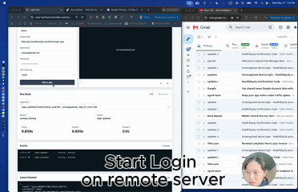
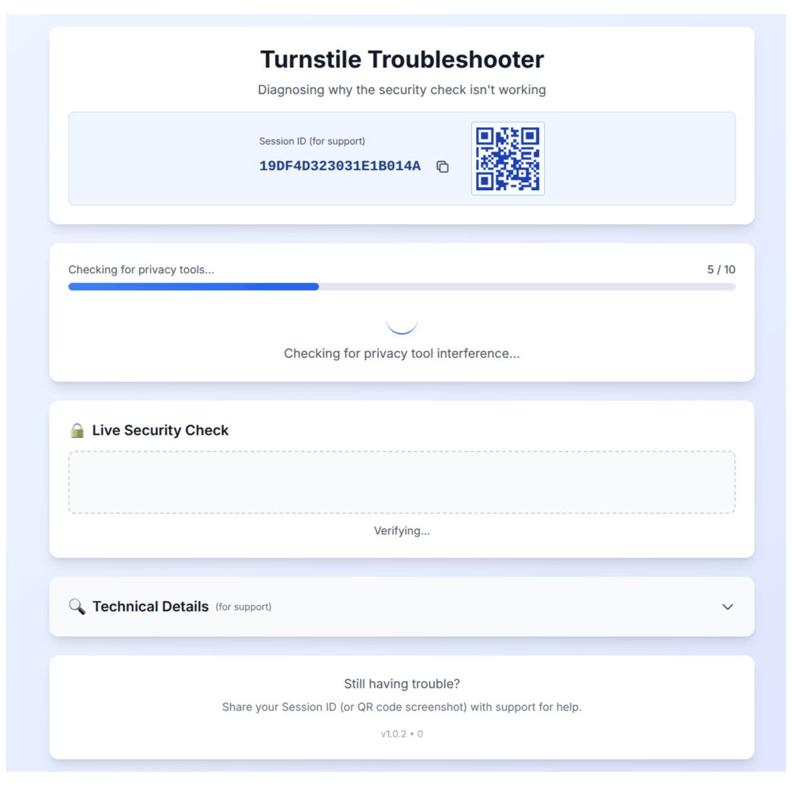
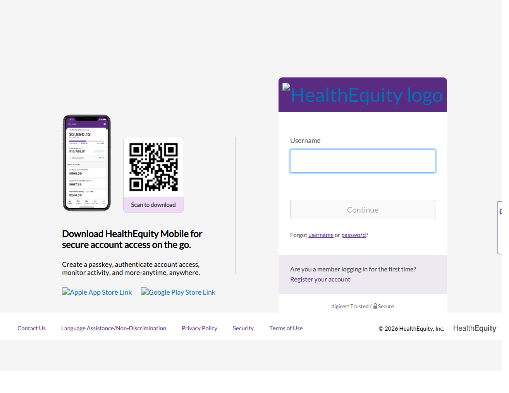

# Login Run 🏃🏻‍♀️

Login Run is minimal API server for human and agents that need to retrieve/input data from websites without APIs.

Agents often need access to platforms where you do not own the end user's account. The user has to log in, pass CAPTCHA or OTP, and then the agent needs to keep working later **without asking the user to repeat the same login flow**. Login Run provides the remote browser session layer for that.

Try it from [Demo site](https://stay-authed.onrender.com/demo)

<a href="https://www.youtube.com/watch?v=nSqYzkXConc">
  
</a>

> [!TIP]
> **Result:** HealthEquity login is now **3x faster** — from **85 seconds** to **24 seconds**.
> So clients can integrate this workflow synchronously, and launch the product!

## What It Provides

Login Run has two parts:

1. **LoginRun API** — a minimal API for logging into anti-bot-heavy web portals, handling CAPTCHA/OTP checkpoints, and maintaining authenticated browser session state for repeat agent workflows.
2. **LoginRun Codegen** — a ReAct-style onboarding loop that generates site profiles and regression fixtures for deterministic browser automation, then validates them locally before they are promoted into API-backed workflows.

The API keeps authentication/session management separate from agent logic. Codegen helps teams add new websites without manually scripting every login flow.

## Current API

The server exposes a small async login API.

```text
GET  /health
POST /v1/logins
GET  /v1/logins/:runId
GET  /v1/logins/:runId/events
POST /v1/logins/:runId/otp
```

Start phase 1:

```bash
curl -s -X POST http://127.0.0.1:8787/v1/logins \
  -H "content-type: application/json" \
  -d '{
    "customerId": "demo-user",
    "targetUrl": "https://example.com/login",
    "username": "user@example.com",
    "password": "password",
    "otpDeliverySelection": "email"
  }'
```

Poll status:

```bash
curl -s http://127.0.0.1:8787/v1/logins/<runId>
```

Submit OTP:

```bash
curl -s -X POST http://127.0.0.1:8787/v1/logins/<runId>/otp \
  -H "content-type: application/json" \
  -d '{"code":"123456"}'
```

Frontend clients can also subscribe to:

```text
GET /v1/logins/:runId/events
```

Polling is the source of truth; SSE is for frontend completion callbacks.

## LoginRun Codegen

Try the standalone Codegen demo without cloning this repo:

```bash
npx @loginrun/codegen demo
```

It generates a redacted HealthEquity-style onboarding profile, fixture artifacts, regression test, and report under `./loginrun/healthequity`. The demo does not submit credentials, request OTP, call LoginRun APIs, or require Browserless configuration.

## Proof of CAPTCHA resolver

Login Run has been tested against Cloudflare Turnstile behavior using the public test page:

```text
https://browser-compat.turnstile.workers.dev/
```

The run below is generated from real captured screenshots:



It has also completed a real HealthEquity-style login workflow against:

```text
https://my.healthequity.com/ClientLogin.aspx
```

The animation below was generated from all screenshots in one captured run:



## Setup

```bash
cp .env.example .env
npm install
npm run start:bl-server
```

Useful environment:

- `BROWSERLESS_TOKEN`
- `BL_PROXY=local|cloud|cloud_stealth|cloud_stealth_residential|cloud_stealth_residential_sticky`
- `PUPPETEER_API_HOST=0.0.0.0`
- `PUPPETEER_API_PORT=8787`

Browserless target profiles live in `config/browserless-targets.json`.

## Scripts

```bash
npm run login:probe
npm run login:probe:concurrency
npm run otp:gmail:init
npm run otp:gmail:watcher
npm test
```
